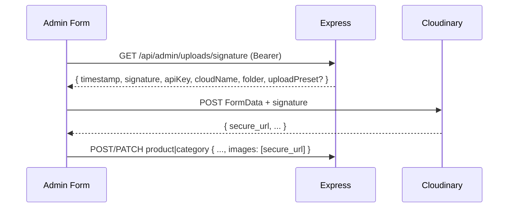

# MINAN Project Documentation

**Scope:** Marketing-focused commerce platform with Order-based checkout, fulfillment, fee payment, COD, returns, refunds, and exchanges.
**Market:** Bangladesh, mobile-first, 3G/4G, Facebook Ads.
**Supabase:** Not used.
**Database:** Data persistence is MongoDB Atlas through the Express API.
**Next.js Route Handlers:** Not used for app data operations. All data operations go through Express, either directly or through the Next.js rewrite proxy. The only `app/api` exception is `/api/revalidate`, which invalidates storefront cache tags and does not read or write app data.

---

## 1. Project Meta

| Property  | Value                                       |
| --------- | ------------------------------------------- |
| Framework | Next.js 16.2.12 App Router                  |
| Phase     | MVP v1                                      |
| Market    | Bangladesh (Sylhet)                         |
| Traffic   | Facebook Ads                                |
| Payment   | bKash full Order payment or advance non-refundable delivery fee with merchandise COD |

---

## 2. Business Goals

- Premium brand experience
- Order creation and auditable fulfillment through first-party MongoDB data
- Meta Pixel + CAPI infrastructure with event deduplication
- Authenticated full-access admin dashboard
- Supports future e-commerce migration
- Facebook custom audience retargeting

---

## 3. Coding Principles

- Follow this documentation and the existing repo patterns before introducing new patterns.
- Follow Next.js 16 conventions: use `proxy.ts`, not `middleware.ts`.
- Production-ready code only. No placeholders or TODO stubs.
- TypeScript strict mode everywhere: no `any`, no `as unknown` casting.
- No Next.js Route Handlers under `app/api/` for data operations. `app/api/revalidate/route.ts` is allowed for cache invalidation only.
- No Next.js Server Actions: `*.actions.ts` files are plain async functions that call Express.
- Next.js rewrites `/api/:path*` to `API_PROXY_TARGET`; do not add data route handlers to replace this.
- Use GSAP for orchestrated page and component motion. CSS/Tailwind transitions and keyframes are allowed for loading states, progress indicators, shadcn/ui state transitions, and small interaction feedback. Do not use or suggest Framer Motion.
- Zustand only for global client state.
- React Hook Form + Zod for forms.
- Do not target Radix UI internal DOM nodes with GSAP.
- Prefer Tailwind v4 utilities for component styling. Global CSS is reserved for theme tokens, base rules, browser-normalization helpers, and shared keyframes. Inline styles are allowed only for calculated runtime values, dynamic color swatches, or third-party component CSS-variable configuration; do not introduce CSS-in-JS libraries.
- Frontend Zod schemas live in `features/<domain>/schemas/`; backend keeps independent equivalent schemas.
- `next/image` for images. Never raw `` tags.
- `next/link` for internal routes. Never raw `<a>` tags for internal navigation.
- Cloudinary URLs are the production image-storage target. Seed data may use temporary remote placeholder URLs.
- BD phone validation regex: `/^(?:\+?88)?01[3-9]\d{8}$/`

---

## 4. Tech Stack

### Frontend

| Technology      | Version / Rule                         |
| --------------- | -------------------------------------- |
| Next.js         | 16.2.12 (App Router, `proxy.ts`)       |
| React           | 19.2.7 (Compiler enabled)              |
| TypeScript      | 6.0.3, strict                          |
| Tailwind CSS    | 4.3.0                                  |
| shadcn/ui       | via `shadcn` package                   |
| Zustand         | 5.x                                    |
| React Hook Form | 7.x                                    |
| Zod             | 4.x                                    |
| GSAP            | 3.x                                    |
| Cloudinary      | via signed uploads + `next/image`      |

### Backend

| Technology         | Version / Rule                 |
| ------------------ | ------------------------------ |
| Node.js            | 24.16.0                        |
| Express.js         | 5.2.1                          |
| MongoDB Atlas      | 8.3 managed cluster target     |
| MongoDB driver     | 7.4.0                          |
| Mongoose           | 9.7.3                          |
| jsonwebtoken       | 9.x                            |
| argon2             | 0.44.x                         |
| cookie-parser      | 1.4.x                          |
| cors               | 2.8.x                          |
| express-rate-limit | 8.x                            |
| helmet             | 8.x                            |
| Zod                | 4.x                            |
| Resend             | 6.x, server-only transactional email adapter |
| Vitest             | 4.x, API test runner           |

### Infrastructure

| Service           | Role                                      | Status             |
| ----------------- | ----------------------------------------- | ------------------ |
| Vercel            | Frontend                                  | Target             |
| Render            | Express API, Node 24.16.0                 | Target             |
| MongoDB Atlas     | Managed MongoDB 8.3                       | Target             |
| Cloudinary        | Image storage + CDN                       | Implemented        |
| Meta Pixel + CAPI | Client helpers + server CAPI              | Partial            |
| GA4               | Traffic + behavior                        | Planned            |
| Microsoft Clarity | Session recordings + heatmaps             | Planned            |
| Vercel Speed Insights | Frontend performance telemetry         | Implemented        |

---

## 5. Architecture

```
Browser -> Next.js (Vercel) -> Express API (Render) -> MongoDB Atlas
```

### Auth Cookie Strategy - Cross-Domain Requirement

Both frontend and backend must run on subdomains of the same parent domain so cookies are readable by `proxy.ts`:

| Service           | Domain          |
| ----------------- | --------------- |
| Frontend (Vercel) | `app.minan.com` |
| Backend (Render)  | `api.minan.com` |

Express sets auth cookies with `AUTH_COOKIE_DOMAIN=.minan.com` in production. This lets the browser send the access token cookie on page requests to `app.minan.com`, so `proxy.ts` can verify admin auth before protected pages render.

**Production cookie auth requires custom domains.** Admin, customer, and guest-access cookies will not work correctly across default `*.vercel.app` and `*.onrender.com` domains because they do not share a parent domain.

### Request Layers

| Layer              | Role                                                                   |
| ------------------ | ---------------------------------------------------------------------- |
| `proxy.ts`         | Verifies the access-token cookie; redirects or defers refresh-cookie recovery to the admin provider |
| Next.js Client     | Sends the applicable in-memory admin or customer Bearer token on API calls |
| Next.js Rewrites   | Proxies `/api/:path*` to `API_PROXY_TARGET` from `next.config.ts`      |
| Next.js Revalidate | Accepts server-to-server storefront cache invalidation at `/api/revalidate` |
| Express Middleware | Verifies Bearer token independently on protected routes                |
| Express Routes     | Business logic, DB ops, CAPI, rate limiting                            |
| Mongoose           | Persistence                                                            |

### `proxy.ts`

`proxy.ts` is placed at `apps/web/src/proxy.ts` and exports the standard Next.js proxy function plus static `config.matcher`. It does not need registration in `next.config.ts`. A missing, expired, or invalid access token is allowed through only when a refresh-token cookie exists; `AdminSessionProvider` then attempts the refresh before rendering the protected admin content. Without a recoverable refresh-token cookie, the proxy redirects to `/admin/login`.

### Admin Boot Flow

`app/(admin)/admin/layout.tsx` wraps protected admin routes in `AdminSessionProvider`. On mount, `AdminSessionProvider` calls `POST /api/auth/refresh` to:

1. Exchange a valid refresh token cookie for new tokens
2. Repopulate `auth.store.ts` with the new access token

If refresh fails, the client clears Zustand and redirects to `/admin/login`.

### CORS

| Option        | Value                                            |
| ------------- | ------------------------------------------------ |
| `origin`      | Comma-separated `ALLOWED_ORIGINS`; requests without an Origin are allowed |
| `credentials` | `true`                                           |

Never use `*` for CORS origin.

---

## 6. Authentication

MINAN has deliberately separate admin and customer identity systems. They use distinct models, JWT signing-key configuration, cookies, routes, middleware, and session stores; neither accepts the other actor's tokens. Guest Order access is a separate, short-lived, proof-bound capability rather than an account session.

**Pattern:** Access and refresh JWTs with server-side refresh-token hash rotation for admins and customers. Guest Order access uses a one-Order JWT issued only after email OTP verification.

### Token Storage

| Actor / token | Storage | TTL |
| ------------- | ------- | --- |
| Admin access / refresh | httpOnly cookies; access token also in Zustand memory; refresh hash on `admin_users` | 15 min / 7 days |
| Customer access / refresh | Separate `customer_*` httpOnly cookies; refresh hash in `customer_sessions` | 15 min / 7 days |
| Guest Order access | `guest_order_access_token` httpOnly cookie or Bearer token; proof is bound to one Order, its normalized email, challenge, and access version | 15 min |

- Admin cookie access token -> `proxy.ts` server-side admin guard
- Admin Zustand access token -> `Authorization: Bearer` header for Express admin API calls
- Customer access may be supplied through its separate cookie or Bearer token; the middleware also confirms the active Customer and CustomerSession
- Refresh tokens are stored only as hashes; the immediately preceding hash supports bounded concurrent-rotation handling

### Cookie Config

| Flag       | Production Value                                         |
| ---------- | -------------------------------------------------------- |
| `httpOnly` | `true`                                                   |
| `secure`   | `true`                                                   |
| `sameSite` | `none` (cross-origin: `app.minan.com` <-> `api.minan.com`) |
| `domain`   | `.minan.com`                                             |
| `path`     | `/`                                                      |

Local development uses `secure: false`, `sameSite: "lax"`, and no cookie domain.

### Admin Auth Flow

1. `POST /api/auth/login` -> argon2 verify -> issue access + refresh cookies and return access token in the response body
2. Express stores `argon2.hash(refreshToken)` on the admin user and clears `previous_refresh_token_hash`
3. Next.js stores access token in `auth.store.ts`
4. `proxy.ts` verifies the access-token cookie; when only a refresh-token cookie is present, it allows `AdminSessionProvider` to attempt recovery before protected content renders
5. API calls send `Authorization: Bearer <accessToken>` from Zustand
6. 401 -> `POST /api/auth/refresh` -> Express atomically rotates refresh-token hash and returns a new access token
7. Concurrent refresh with the immediately previous token returns `409 Concurrent token rotation`
8. `POST /api/auth/logout` clears cookies and nulls refresh-token hashes

Only the refresh token whose hash matches `refresh_token_hash` is accepted, with a narrow previous-token check for concurrent rotation. Replay of older refresh JWTs fails after rotation. Deactivated admins fail login and refresh. Because access tokens are stateless, an access token issued before deactivation can remain valid until its 15-minute expiry.

### Customer Auth and Order Access

- `/api/customer-auth` currently exposes login, refresh, logout, and authenticated `me` endpoints. Customer signup remains intentionally unavailable until mailbox ownership verification is complete.
- Customer JWTs carry the `customer` actor and `minan-customer` audience, plus customer ID, email, session ID, and session version. Customer auth has separate identities, credentials, cookies, routes, and middleware from admin auth.
- `/api/guest-order-access/otp/request` accepts exactly one Order number and email, always returns a generic accepted response, and sends a code only when the pair matches. OTPs are hashed, time-limited, single-use, rate-limited, and sent by the server-only Resend adapter.
- A verified guest may read only the proof-bound Order through the customer-safe serializer. A separately authenticated customer may claim that exact unowned Order with the proof; the atomic claim increments `guest_access_version` and never bulk-links historical Orders by email.
- `/api/customer-orders/:orderNumber` returns only an Order whose `customer_id` matches the authenticated customer. The public `/orders` tracking experience supports guest OTP access and existing-customer order access; `/account/login` signs existing customers in.

### CSRF Mitigation

- `X-Requested-With: XMLHttpRequest` is required on all state-changing requests
- The shared `apiRequest` client adds this header for non-GET requests
- Browser form posts from third-party sites cannot set this custom header
- Refresh-token rotation limits replay after a successful refresh

---

## 7. Admin Access

MINAN uses one authenticated admin model. Every active admin account has the full admin feature set: dashboard, product CRUD, category and subcategory management, Order fulfillment, uploads, and admin-user management.

### Enforcement

- JWT payload: `{ id, email }`
- Legacy JWTs may contain a `role` claim, but current code ignores it
- Express admin routes require authenticated Bearer tokens
- Admin write routes also require `X-Requested-With: XMLHttpRequest`
- `proxy.ts` reads the access-token cookie only to verify authenticated admin page access
- Do not accept role or privilege values from request bodies

### Self-Guard Rule

An admin cannot deactivate their own account:

- `PATCH /api/admin/admins/:id` rejects self `is_active: false`
- `PATCH /api/admin/admins/:id/deactivate` rejects self-deactivation
- Enforcement lives in the admins service/controller, not middleware

---

## 8. Database - MongoDB Atlas 8.3, Mongoose 9.x

### `products`

| Field                     | Type                       | Notes                         |
| ------------------------- | -------------------------- | ----------------------------- |
| `_id`                     | ObjectId                   | PK                            |
| `name`                    | String                     | required                      |
| `slug`                    | String                     | required, unique              |
| `description`             | String                     | required                      |
| `price`                   | Number                     | original price, required, min: 0 |
| `discount`                | Number                     | integer percent, default `0`, min: 0, max: 100 |
| `category_id`             | ObjectId (ref: `Category`) | required                      |
| `subcategory_id`          | ObjectId (ref: `Subcategory`) / null | optional, default `null`, indexed |
| `sizes`                   | [String]                   | default `[]`                  |
| `colors`                  | [String]                   | default `[]`                  |
| `images`                  | [String]                   | remote image URLs             |
| `is_active`               | Boolean                    | default `true`                |
| `createdAt` / `updatedAt` | Date                       | timestamps                    |

### `categories`

| Field                     | Type     | Notes              |
| ------------------------- | -------- | ------------------ |
| `_id`                     | ObjectId | PK                 |
| `name`                    | String   | required           |
| `slug`                    | String   | required, unique   |
| `image_url`               | String   | remote image URL   |
| `is_active`               | Boolean  | default `true`     |
| `createdAt` / `updatedAt` | Date     | timestamps         |

### `subcategories`

| Field                     | Type                       | Notes |
| ------------------------- | -------------------------- | ----- |
| `_id`                     | ObjectId                   | PK |
| `category_id`             | ObjectId (ref: `Category`) | required |
| `name`                    | String                     | required |
| `slug`                    | String                     | required, unique, lowercase |
| `display_order`           | Number                     | required, default `0`, min: 0 |
| `is_active`               | Boolean                    | default `true` |
| `createdAt` / `updatedAt` | Date                       | timestamps |

Subcategories are managed within the admin category experience. Public catalog filters expose active subcategories that are referenced by active products, grouped under their parent categories. A product may omit its subcategory.

### `orders`

| Field                     | Type     | Notes |
| ------------------------- | -------- | ----- |
| `_id`                     | ObjectId | PK |
| `name`                    | String   | required |
| `phone_number`            | String   | required, BD format |
| `email`                   | String   | required |
| `normalized_email`        | String   | required normalized email, indexed; used for one-Order guest proof only |
| `address`                 | String   | required |
| `customer_notes`          | String   | optional customer checkout note |
| `order_number`            | String   | unique `MN-YYYYMMDD-####` allocated by an atomic daily counter |
| `lines`                   | Array    | frozen product/variant/price/discount lines with return and credit accounting |
| `status`                  | String   | `new | confirmed | processing | shipped | delivered | on_hold | cancelled | returned | exchanged` |
| `checkout_source`         | String   | `cart | buy_now | exchange` |
| `shipping_zone`           | String   | optional `inside_sylhet` or `outside_sylhet`; historical/exchange Orders remain unspecified |
| `payment_method`          | String   | optional `bkash_full | cod`; absent on historical/exchange Orders |
| `settled_payment_attempt_id` | ObjectId | first successfully reconciled current-checkout attempt; prevents cross-purpose overwrite |
| `checkout_idempotency_hash` | String | unique, sparse, server-only |
| `customer_id`             | ObjectId / null | optional Customer ownership; guest Orders remain unowned until an exact proof-based claim |
| `guest_access_version`    | Number   | positive access-proof revision; increments when an Order is claimed |
| `expected_delivery_date`  | Date / null | UTC-midnight estimated delivery date, managed by staff |
| `customer_note` (activity timeline) | String / null | optional admin-authored customer-visible note on an `OrderActivity` entry; surfaced only on that customer timeline entry while internal activity remains private |
| `financials`              | Object   | integer-BDT merchandise, discount, fee, COD, paid, refunded, and exchange-credit snapshots |
| `delivery_fee_status`     | String   | independent fee lifecycle |
| `cod_status`              | String   | independent COD lifecycle |
| `revision`                | Number   | compare-and-swap mutation revision |
| `activity` / `refunds`    | Array    | append-only operational audit records |
| `createdAt` / `updatedAt` | Date     | timestamps |

The legacy `leads` collection remains unchanged for one compatibility release and is a migration rollback source only. New checkouts are not dual-written.

### `customers` and `customer_sessions`

`customers` holds the customer email, normalized-email unique index, argon2 password hash, active flag, and session version. `customer_sessions` holds a Customer reference, session version, refresh-token hash, immediate previous hash, expiry, rotation time, and revocation time. `customers.toJSON` excludes the password hash, normalized email, and session version; `customer_sessions.toJSON` excludes both refresh-token hashes. The session collection has TTL cleanup on `expires_at` and an active-session lookup index.

### `verification_challenges`

Guest access challenges are bound to one `order_id`, normalized email, and the required `purpose: guest_order_access` discriminator. Each record stores only a hashed OTP, attempt count/limit, expiry, one-time consumption/revocation state, and resend availability. TTL removes expired challenges. They are not reusable customer-login or account-verification records.

### `notification_outboxes`

The notification outbox reliably queues customer-safe transactional-email events: `order_created`, `status_confirmed`, `status_shipped`, `status_delivered`, and `status_cancelled`. A record stores the Order reference, recipient email, event type, unique dedupe key, serialized customer-safe Order snapshot, delivery status, retry schedule/count, processing lease, provider message ID, and a bounded error message. The server processor leases up to 100 due records per run, runs every minute, and marks an event failed after three delivery attempts. Actual delivery still depends on valid Resend credentials and sender-domain verification.

### `payment_attempts`

Each checkout attempt is linked through `order_id` with `payment_purpose: delivery_fee | order_total`. It stores the frozen purpose and exact amount, Order-number invoice, provider result, and hashed short-lived result/retry references. `lead_id` remains nullable only for the compatibility release; migrated attempts are classified `legacy_full_order`. Retries preserve the prior purpose and amount and never reprice merchandise.

### `bkash_tokens`

Private singleton cache for the bKash token grant. It is shared across Render cold starts; secrets and token values are never serialized to storefront or admin responses.

### `analytics_events`

| Field          | Type                       | Notes |
| -------------- | -------------------------- | ----- |
| `_id`          | ObjectId                   | PK |
| `event_type`   | String                     | `page_view | product_view | add_to_cart | checkout_start | lead_submit | whatsapp_click` |
| `event_id`     | String                     | UUID, unique, CAPI dedup key |
| `product_id`   | ObjectId (ref: `Product`)  | optional |
| `category_id`  | ObjectId (ref: `Category`) | optional |
| `session_id`   | String                     | required |
| `utm_source`   | String                     | optional |
| `utm_medium`   | String                     | optional |
| `utm_campaign` | String                     | optional |
| `createdAt`    | Date                       | timestamp only |

`analytics_events` uses `{ timestamps: { createdAt: true, updatedAt: false } }`.

### `admin_users`

| Field                         | Type        | Notes |
| ----------------------------- | ----------- | ----- |
| `_id`                         | ObjectId    | PK |
| `email`                       | String      | required, unique, lowercase |
| `password`                    | String      | argon2 hashed, never in API response |
| `is_active`                   | Boolean     | default `true` |
| `refresh_token_hash`          | String/null | selected only when needed |
| `previous_refresh_token_hash` | String/null | selected only when needed, concurrent rotation guard |
| `createdAt` / `updatedAt`     | Date        | timestamps |

### `home_banner_sets`

| Field                      | Type     | Notes |
| -------------------------- | -------- | ----- |
| `key`                      | String   | singleton key `homepage`, unique |
| `revision`                 | Number   | optimistic-concurrency revision |
| `banners`                  | Array    | ordered 1-5 items with descriptive `alt_text` and desktop/mobile image URLs |
| `storefront_sync_pending`  | Boolean  | retry signal when cache invalidation fails |
| `pending_cleanup_urls`     | [String] | removed managed images retained until storefront sync succeeds |
| `createdAt` / `updatedAt`  | Date     | timestamps |

The storefront uses one generic screen-reader-only promotional heading for the hero carousel. Headlines are not stored or managed per banner.

### Mongoose Patterns

- `timestamps: true` on all schemas except `analytics_events`
- Products support reversible deactivation through `is_active` and explicit admin-only permanent deletion; categories, subcategories, and admins remain soft-delete-only
- Product queries populate `category_id` and `subcategory_id` when their related data is needed
- Indexes: product/category/subcategory `slug`, product `subcategory_id`, subcategory `{ category_id, display_order, name }`, admin `email`, Customer `normalized_email`, CustomerSession expiry/active-session indexes, Order `{ customer_id, createdAt }`, NotificationOutbox `dedupe_key` and `{ status, available_at, locked_at }`, analytics `{ event_type, createdAt }`, analytics `event_id`
- `pre("save")` on admin users hashes passwords
- `toJSON` transform on admin users strips password and refresh-token hashes

---

## 9. API Routes (Express)

### Public

| Method | Route                 | Description |
| ------ | --------------------- | ----------- |
| GET    | `/api/products`       | List active products. Query params: `category`, `subcategory`, `color`, `size`, `search`, `minPrice`, `maxPrice`, `sort`, `page`, `limit`, `exclude` |
| GET    | `/api/products/home`  | Active categories with up to seven newest active products per category and group totals |
| GET    | `/api/products/filters` | Active catalog filter options: categories with referenced subcategories, colors, sizes, and effective min/max price |
| POST   | `/api/products/quote` | Read-only availability and current discount-price quote for up to 50 submitted product IDs; duplicates are deduplicated |
| GET    | `/api/products/:slug` | Single active product by slug |
| GET    | `/api/home-banners`   | Ordered homepage banners with responsive images and image descriptions; empty until the singleton seed exists |
| GET    | `/api/checkout/config` | Cacheable backend-authoritative ordered shipping options, BDT fees, and non-refundable policy |
| POST   | `/api/bkash/payments` | Create/idempotently retrieve an Order and start its frozen delivery-fee attempt |
| GET    | `/api/bkash/callback` | Verify and reconcile the provider redirect, including valid late completions |
| POST   | `/api/bkash/results/resolve` | Resolve an opaque result reference to Order number, fee, COD, and transaction details |
| POST   | `/api/bkash/payments/retry` | Create another fee attempt from an opaque retry token without repricing |
| POST   | `/api/analytics`      | Log analytics event and forward mapped events to Meta CAPI, CSRF-header protected, rate-limited 60 req/15 min/IP |
| POST   | `/api/whatsapp-click` | Log WhatsApp click and forward to Meta CAPI, CSRF-header protected, rate-limited 60 req/15 min/IP |
| POST   | `/api/auth/login`     | Admin login, CSRF-header protected, rate-limited 10 req/15 min/IP |
| POST   | `/api/auth/refresh`   | Rotate tokens, CSRF-header protected |
| POST   | `/api/auth/logout`    | Clear auth cookies and refresh-token hashes, CSRF-header protected |
| POST   | `/api/customer-auth/login` | Customer login, CSRF-header protected, rate-limited 10 req/15 min/IP |
| POST   | `/api/customer-auth/refresh` | Rotate a customer session, CSRF-header protected, rate-limited 30 req/15 min/IP |
| POST   | `/api/customer-auth/logout` | Clear customer cookies and revoke the current session, CSRF-header protected |
| GET    | `/api/customer-auth/me` | Current authenticated customer, allowlisted response |
| POST   | `/api/guest-order-access/otp/request` | Request an email OTP for one Order number/email pair; generic response, CSRF-header protected, rate-limited 5 req/15 min/IP |
| POST   | `/api/guest-order-access/otp/verify` | Verify a one-time guest Order OTP and issue short-lived access proof, CSRF-header protected, rate-limited 10 req/15 min/IP |
| GET    | `/api/guest-order-access/orders/:orderNumber` | Read only the Order bound to valid guest proof using the customer-safe serializer |
| POST   | `/api/guest-order-access/orders/:orderNumber/claim` | Claim that exact unowned Order for an authenticated customer with valid guest proof |
| GET    | `/api/customer-orders/:orderNumber` | Read one Order owned by the authenticated customer |

### Health

| Method | Route     | Description |
| ------ | --------- | ----------- |
| GET    | `/health` | API health check with MongoDB connection status. Returns `200 ok` or `503 degraded` |

There is no public `GET /api/categories` route. Homepage category navigation comes from `/api/products/home`; catalog categories and referenced subcategories come from `/api/products/filters`.

The `subcategory` product filter is applied only when at least one `category` filter is also selected. Requested subcategories must be active and belong to the selected categories.

### Protected Admin

| Method | Route                                  | Role              | Description |
| ------ | -------------------------------------- | ----------------- | ----------- |
| GET    | `/api/admin/dashboard`                 | admin | Order workflow plus product/category view and traffic metrics |
| GET    | `/api/admin/orders`                    | admin | Paginated search/filter summaries |
| GET    | `/api/admin/orders/changes`            | admin | Opaque-cursor new-Order polling |
| GET    | `/api/admin/orders/export`             | admin | Filtered, injection-safe UTF-8 CSV; 10,000-row cap |
| GET    | `/api/admin/orders/:id`                | admin | Full Order, activity, refunds, and payment attempts |
| PATCH/POST | `/api/admin/orders/:id/*`          | admin | Revision-safe customer/items/workflow/courier/COD/notes/duplicates/returns/refunds/exchanges/payment-recheck operations |
| GET    | `/api/admin/products`                  | admin | List all products, including inactive. Query params: `search`, `category_id`, `status`, `page`, `limit` |
| POST   | `/api/admin/products`                  | admin | Create product |
| PATCH  | `/api/admin/products/:id`              | admin | Update product, including `is_active: true` reactivation |
| PATCH  | `/api/admin/products/:id/deactivate`   | admin | Soft delete |
| DELETE | `/api/admin/products/:id`              | admin | Permanently delete a product and clean up its unreferenced managed Cloudinary images |
| GET    | `/api/admin/categories`                | admin | List all categories |
| POST   | `/api/admin/categories`                | admin | Create category |
| PATCH  | `/api/admin/categories/:id`            | admin | Update category, including `is_active: true` reactivation |
| PATCH  | `/api/admin/categories/:id/deactivate` | admin | Soft delete, blocked when active products reference the category |
| GET    | `/api/admin/subcategories`             | admin | List subcategories, optionally filtered by `category_id` |
| POST   | `/api/admin/subcategories`             | admin | Create a subcategory under a category |
| PATCH  | `/api/admin/subcategories/reorder`     | admin | Replace the complete display order for a category's subcategories |
| PATCH  | `/api/admin/subcategories/:id`         | admin | Update subcategory name or slug |
| PATCH  | `/api/admin/subcategories/:id/deactivate` | admin | Soft deactivate, blocked when active products reference the subcategory |
| PATCH  | `/api/admin/subcategories/:id/reactivate` | admin | Reactivate a subcategory |
| GET    | `/api/admin/admins`                    | admin | List admins |
| POST   | `/api/admin/admins`                    | admin | Create admin |
| PATCH  | `/api/admin/admins/:id`                | admin | Update admin, including `is_active: true` reactivation |
| PATCH  | `/api/admin/admins/:id/deactivate`     | admin | Soft disable |
| GET    | `/api/admin/uploads/signature`         | admin | Get Cloudinary signed upload params |
| POST   | `/api/admin/uploads/delete`            | admin | Delete unreferenced managed Cloudinary uploads by public ID |
| GET    | `/api/admin/home-banners`              | admin | Get the versioned ordered banner set and sync state |
| POST   | `/api/admin/home-banners`              | admin | Append a banner with an image description, responsive images, and `expected_revision`; maximum five |
| PATCH  | `/api/admin/home-banners/reorder`      | admin | Replace the complete order using `expected_revision` |
| POST   | `/api/admin/home-banners/sync`         | admin | Retry storefront invalidation and deferred media cleanup |
| PATCH  | `/api/admin/home-banners/:id`          | admin | Update the image description or one/both responsive images using `expected_revision` |
| DELETE | `/api/admin/home-banners/:id`          | admin | Remove a banner using `expected_revision`; the final banner is protected |

Admin write routes require `requireAuth` and `requireCsrfHeader`.

---

## 10. Pages / Routes

| Route               | Page                | Access            |
| ------------------- | ------------------- | ----------------- |
| `/`                 | Home                | Public            |
| `/products`         | Product Listing     | Public            |
| `/products/[slug]`  | Product Detail      | Public            |
| `/cart`             | Cart                | Public            |
| `/checkout`         | Checkout            | Public            |
| `/checkout/buy-now` | Buy-now Checkout    | Public            |
| `/orders`           | Order Tracking      | Public; guest OTP or authenticated customer access |
| `/account/login`    | Customer Login      | Public; existing customer accounts |
| `/admin/login`      | Admin Login         | Public            |
| `/admin`            | Dashboard           | Admin             |
| `/admin/products`   | Product Management  | Admin             |
| `/admin/categories` | Category Management | Admin             |
| `/admin/home-banners` | Homepage Banner Management | Admin        |
| `/admin/orders`     | Order Fulfillment   | Admin             |
| `/admin/orders/[id]` | Order Detail       | Admin             |
| `/admin/orders/[id]/invoice` | Printable invoice | Admin      |
| `/admin/orders/[id]/packing-slip` | Printable packing slip | Admin |
| `/admin/leads`      | Redirect to Orders  | Admin             |
| `/admin/admins`     | Admin Management    | Admin             |

`/admin/login` lives under the public route group at `app/(public)/admin/login/page.tsx`. Protected admin routes live under `app/(admin)/admin/`.

---

## 11. Frontend Structure Rules

- `app/(public)/` contains storefront routes.
- `app/(admin)/admin/` contains protected admin routes and the admin shell layout.
- `app/(public)/admin/login/page.tsx` is public so unauthenticated admins can reach it.
- Public layout chrome is `components/layouts/PublicChrome.tsx`.
- Admin layout chrome is `components/layouts/AdminShell.tsx`.
- `features/<domain>/` colocates domain components, hooks, actions, services, schemas, and types.
- `features/<domain>/actions/*.actions.ts` are plain async functions calling Express. No `"use server"`.
- `components/ui/` is shadcn/ui output.
- `lib/api/client.ts` is the fetch wrapper. Do not use axios.
- `features/products/services/product.cache.ts` owns the storefront Cache Component functions. They use `"use cache"`, the shared `catalog` tag, and the `days` cache-life profile.
- `next.config.ts` rewrites `/api/:path*` to `API_PROXY_TARGET`, defaulting to `http://localhost:3001`.
- `lib/analytics/pixel.ts` contains client-side Meta Pixel helpers only. CAPI is Express-only.
- `store/auth.store.ts` keeps the access token in memory only.
- `features/order-tracking/` owns customer and guest tracking UI. `store/customer-auth.store.ts` keeps the customer session, including its access token, in memory only; refresh recovery uses the separate httpOnly customer cookie.
- `store/cart.store.ts` keeps cart items in Zustand and persists selected cart lines to browser `localStorage`.

---

## 12. Checkout / Order Form

| Field          | Type     | Required | Notes |
| -------------- | -------- | -------- | ----- |
| `name`         | text     | yes      | min 2, max 80 |
| `phone_number` | text     | yes      | BD regex `/^(?:\+?88)?01[3-9]\d{8}$/` |
| `email`        | email    | yes      | valid email |
| `address`      | textarea | yes      | min 8, max 400 |
| `shipping_zone` | radio   | yes      | `inside_sylhet` or `outside_sylhet`; the browser never submits a fee amount |
| `payment_method` | radio  | yes      | `bkash_full` or `cod`; neither is preselected under payment contract v2 |
| `notes`        | textarea | no       | max 500 |

`GET /api/checkout/config` exposes `inside_sylhet` and `outside_sylhet` in display order with backend-authoritative positive integer fees, BDT currency, the non-refundable policy, payment contract v2 (`bkash_full`, `cod`), and ETag/revalidation metadata. During the compatibility release it also exposes the legacy `delivery_fee`; absence of `payment_contract` keeps the previous fee-only COD storefront behavior. Checkout is disabled when the applicable fee contract is unavailable or invalid. Shipping and v2 payment choices start unselected.

`POST /api/bkash/payments` requires a shipping-zone ID for zone-aware requests and maps it to the current server configuration. It accepts `payment_method: bkash_full | cod`; missing values temporarily default to `cod` for the previous storefront. It verifies products, variants, and prices server-side, creates one frozen Order per idempotency key, and charges either `overall_order_value` for full payment or `delivery_fee` for COD. The payment method is excluded from the browser idempotency fingerprint so a confirmed-terminal switch reuses the Order, while active or uncertain attempts block switching. Full payment sets online-paid merchandise to the frozen merchandise total and COD due to zero; COD completion pays only the fee. The fee is non-refundable and excluded from return, refund, and exchange-credit calculations. Retries preserve the original purpose and exact amount. First completion wins atomically; a late second completion triggers financial review instead of overwriting settled balances. Callback Execute/query recovery, signature checks, amount/currency/invoice verification, result tokens, rate limits, and late completion reconciliation remain mandatory. Cart state clears only after a completed result resolves.

---

## 13. MVP Features

- Animated UI with GSAP, responsive, mobile-first
- Product categories: T-Shirts, Shirts, Pants, Footwear, Accessories, Women, Kids
- WhatsApp ordering from PDP with pre-filled message and `/api/whatsapp-click`
- Cart stored in Zustand and persisted to browser `localStorage`
- Product catalog supports multi-select category/subcategory/color/size filters, effective min/max price filters, sort (`newest`, `price-asc`, `price-desc`, `name-asc`), URL-backed state, and infinite scroll
- Products support integer percentage discounts. APIs retain the original `price` and expose the rounded `discounted_price`; storefront cards, PDP, cart, buy-now, and frozen Order lines use the effective discounted price.
- Header search provides debounced product suggestions and links submitted searches to `/products?search=...`
- Checkout creates one MongoDB Order with separate auditable full-Order or delivery-fee payment attempts
- Checkout verifies cart products, prices, sizes, and colors server-side before persisting the frozen Order snapshot
- Authenticated admin management for products, categories, ordered subcategories, Orders, admins, and managed uploads
- Versioned homepage banner management with 16:9 desktop and 4:5 mobile Cloudinary assets, atomic ordering, and deferred cleanup
- Dashboard aggregates Bangladesh-local Order workflow metrics, top viewed product/category, and traffic sources
- Vercel Speed Insights is mounted in the root frontend layout
- Customer and guest order tracking use the customer-safe Order serializer; qualifying Order events enqueue transactional emails through the notification outbox.

---

## 14. Analytics & Tracking

Analytics is partially implemented. Keep current/live behavior separate from planned wiring.

### Tool Matrix

| Tool               | Fires From     | Role                                      | Status |
| ------------------ | -------------- | ----------------------------------------- | ------ |
| Meta Pixel helpers | Next.js client | `fbq("track")` helpers                    | Partial - helpers exist, no global bootstrap script |
| Meta CAPI          | Express        | Server-side mapped events                 | Implemented for events posted to analytics endpoints |
| GA4                | Next.js client | Traffic and conversion analytics          | Planned |
| Microsoft Clarity  | Next.js client | Session recordings and heatmaps           | Planned |
| `analytics_events` | Express        | First-party MongoDB analytics log         | Implemented |

### Current Event Status

| Event            | Client Pixel | Express CAPI | Status |
| ---------------- | ------------ | ------------ | ------ |
| `page_view`      | planned      | no           | Planned |
| `product_view`   | helper-ready | endpoint-ready | Planned wiring |
| `add_to_cart`    | helper-ready | endpoint-ready | Planned wiring |
| `checkout_start` | helper-ready | endpoint-ready | Planned wiring |
| `lead_submit`    | no           | backend-ready | Not fired by the payment create flow yet |
| `whatsapp_click` | yes          | yes          | Live |

### Deduplication Pattern

For deduped events:

1. Client generates `event_id` with `crypto.randomUUID()`
2. Client fires Meta Pixel with `event_id`
3. Client POSTs to Express with the same `event_id`
4. Express writes `analytics_events` and forwards to Meta CAPI
5. Meta deduplicates on matching `event_id`

Current end-to-end live path: `whatsapp_click`.

Duplicate analytics `event_id` values are ignored before insert, so retries do not create duplicate MongoDB analytics rows.

---

## 15. Performance

- Mobile-first, optimized for Bangladesh 3G/4G users
- Public home/catalog/product pages use explicit `"use cache"` Cache Component functions with `cacheLife("days")` and the shared `catalog` cache tag.
- Homepage banners use the separate `home-banners` cache tag with a short cache life and bundled local fallback assets.
- Product, category, and subcategory admin writes trigger Express-to-Next revalidation with `revalidateTag("catalog", { expire: 0 })`.
- Catalog page server-renders the first page and filter options, then the client hook loads more pages with a page size of 20
- Turbopack in development
- MongoDB indexes: product/category/subcategory `slug`, product `subcategory_id`, subcategory `{ category_id, display_order, name }`, admin `email`, analytics `{ event_type, createdAt }`, analytics `event_id`
- GSAP animation should stay on `transform` and `opacity`
- Render cold start mitigation can use a keep-alive ping if on free-tier instances

---

## 16. Security

| Concern          | Mitigation |
| ---------------- | ---------- |
| XSS token theft  | httpOnly cookies for browser-stored tokens |
| CSRF             | `X-Requested-With: XMLHttpRequest` on state-changing requests |
| Password storage | argon2 |
| Refresh replay   | server-side refresh-token hash rotation |
| Token expiry     | Access: 15 min; Refresh: 7 days |
| Customer/admin separation | Distinct models, session stores, JWT audiences, cookie names, routes, and middleware; configure signing keys independently |
| Guest Order authorization | One-Order/email/challenge/version-bound proof after hashed, single-use OTP; no email-based enumeration or bulk ownership linking |
| Brute force      | Rate-limit admin/customer login and guest OTP request/verify routes |
| Checkout spam    | layered IP and idempotency-key limits on `/api/bkash/payments` |
| Proxy spoofing   | In production trust only `loopback`, `linklocal`, and `uniquelocal` address ranges, stopping at the first public hop; never use blanket `trust proxy: true` |
| HTTP headers     | `helmet` |
| CORS             | specific `ALLOWED_ORIGINS`, credentials enabled, never `*` |
| Password leak    | Mongoose `toJSON` strips `password` |
| Privilege escalation | Single admin access model; never accept role or privilege values from request body |

---

## 17. Deployment & Env Vars

| Service  | Platform              | Domain          |
| -------- | --------------------- | --------------- |
| Frontend | Vercel                | `app.minan.com` |
| Backend  | Render, Node 24.16.0  | `api.minan.com` |
| Database | MongoDB Atlas 8.3     | -               |
| Images   | Cloudinary            | -               |

Custom domains are required for production cookie auth.

### Database maintenance and migration retirement

The Order/payment expansion and the product, banner, admin-role, lead-checkout, and packing-status backfills are complete; their one-time scripts and npm aliases are retired.

Retain `npm --workspace @minan/api run migrate:orders` until every legacy payment attempt has `order_id` and no longer depends on `lead_id`. It reports a dry run by default. Before any `-- --apply` run, take a database backup, resolve all reported anomalies, enable checkout maintenance for payment creation/retry, and keep callbacks, results, and admin rechecks available. Re-run the dry run afterward to verify counts, financial totals, attempt links, transaction IDs, and dashboard metrics.

The migration preserves Lead `_id` values, timestamps, checkout snapshots and idempotency hashes; assigns deterministic Bangladesh-date Order numbers; classifies pre-cutover attempts `legacy_full_order`; backfills `order_id` while retaining `lead_id`; and leaves `leads` untouched. Keep the legacy collection until the compatibility and rollback window is explicitly closed. Legacy Leads are not a rollback path for Orders created after cutover.

The separate `migrate:order-tracking` command is also dry-run by default. Before guest/customer Order access can rely on historical records, run `npm --workspace @minan/api run migrate:order-tracking`, resolve every unusable email snapshot, take a backup, then run `npm --workspace @minan/api run migrate:order-tracking -- --apply`. Its compare-and-set writes stop rather than overwrite a concurrent change. Completion requires a final dry run reporting zero Orders to backfill and zero unresolved records. It never assigns `customer_id`, adds activity, or changes timestamps.

Admin role removal changed the auth and admin-user payload shapes. Deploy the API and web app in the same release window; old web against new API or new web against old API can break admin refresh/admin-user forms. Existing legacy JWTs that still include `role` are tolerated by the new parser as long as they contain valid `id` and `email` claims.

### Frontend `.env.local`

```env
API_PROXY_TARGET=https://api.minan.com
JWT_ACCESS_SECRET=<same value as API>
REVALIDATE_SECRET=<same value as STOREFRONT_REVALIDATE_SECRET>
NEXT_PUBLIC_META_PIXEL_ID=
NEXT_PUBLIC_GA4_ID=
NEXT_PUBLIC_CLOUDINARY_CLOUD_NAME=
NEXT_PUBLIC_SITE_URL=https://www.minanclothing.com
NEXT_PUBLIC_WHATSAPP_NUMBER=01XXXXXXXXX
```

- `API_PROXY_TARGET` is used by both `next.config.ts` rewrites and `lib/api/client.ts`.
- `JWT_ACCESS_SECRET` is required by `proxy.ts` to verify access-token cookies.
- `NEXT_PUBLIC_SITE_URL` is used for canonical URLs, sitemap entries, and social metadata.

### Backend `.env`

```env
PORT=3001
MONGODB_URI=
JWT_ACCESS_SECRET=
JWT_REFRESH_SECRET=
CUSTOMER_JWT_ACCESS_SECRET=
CUSTOMER_JWT_REFRESH_SECRET=
GUEST_ORDER_JWT_SECRET=
# Optional bounded values: defaults 600 seconds, 5 attempts, 60-second resend cooldown.
GUEST_ORDER_OTP_TTL_SECONDS=600
GUEST_ORDER_OTP_ATTEMPT_LIMIT=5
GUEST_ORDER_OTP_RESEND_COOLDOWN_SECONDS=60
AUTH_COOKIE_DOMAIN=.minan.com
ALLOWED_ORIGINS=http://localhost:3000,https://minan-web.vercel.app, https://minanclothing.com
META_CAPI_TOKEN=
META_PIXEL_ID=
CLOUDINARY_URL=
CLOUDINARY_UPLOAD_FOLDER=
CLOUDINARY_HOME_BANNER_UPLOAD_PRESET=
ADMIN_EMAIL=
ADMIN_PASSWORD=
NODE_ENV=
STOREFRONT_REVALIDATE_URL=https://app.minan.com/api/revalidate
STOREFRONT_REVALIDATE_SECRET=<same value as REVALIDATE_SECRET>
BKASH_BASE_URL=https://tokenized.sandbox.bka.sh/v1.2.0-beta
BKASH_APP_KEY=
BKASH_APP_SECRET=
BKASH_USERNAME=
BKASH_PASSWORD=
RESEND_API_KEY=
RESEND_FROM=MINAN <orders@example.com>
DELIVERY_FEE_BDT=100
DELIVERY_FEE_INSIDE_SYLHET_BDT=60
DELIVERY_FEE_OUTSIDE_SYLHET_BDT=120
API_PUBLIC_URL=https://api.minan.com
FRONTEND_URL=https://app.minan.com
```

- `AUTH_COOKIE_DOMAIN` should be `.minan.com` in production when frontend and backend share the parent domain.
- `CUSTOMER_JWT_ACCESS_SECRET`, `CUSTOMER_JWT_REFRESH_SECRET`, and `GUEST_ORDER_JWT_SECRET` must all be set. Startup enforces that the customer access and refresh secrets differ; configure three independent high-entropy values and never reuse the admin signing secrets. JWT audiences and actor claims are additional token-type separation, not a reason to share signing keys.
- `RESEND_API_KEY` stays server-side and `RESEND_FROM` must use a Resend-verified sender domain. Startup validates the API-key format and sender syntax along with bKash, shipping, customer-auth, and guest-OTP configuration; Resend verifies the sender domain when sending.
- In production, Express trusts only `loopback`, `linklocal`, and `uniquelocal` address ranges when resolving client IPs, stopping at the first public hop. Do not replace this with `trust proxy: true`.
- `seed:admin` upserts by `ADMIN_EMAIL`. Rerunning it updates that admin's password and `is_active: true`.
- `cleanup:inactive-admin-sessions` is a guarded legacy-maintenance command. Run it without `--apply` before reactivating an inactive legacy admin; after reviewing the count, rerun with `-- --apply` to clear stale refresh-token hashes and advance `session_version`. Normal admin deactivation performs this revocation automatically.
- `STOREFRONT_REVALIDATE_URL` and `STOREFRONT_REVALIDATE_SECRET` let admin product/category writes expire the public storefront cache without blocking or rolling back the saved mutation on webhook failure.
- `API_PUBLIC_URL` must be the directly reachable Render API origin used for the bKash callback. `FRONTEND_URL` is the Vercel storefront origin used after callback verification.
- `DELIVERY_FEE_INSIDE_SYLHET_BDT=60`, `DELIVERY_FEE_OUTSIDE_SYLHET_BDT=120`, and compatibility fallback `DELIVERY_FEE_BDT=100` are required positive integers for this release; do not add frontend public fee variables. Remove the fallback only in a later cleanup release after the previous storefront can no longer send traffic.
- `CHECKOUT_MAINTENANCE_MODE=true` blocks payment creation and retry during migration while preserving callbacks, result resolution, and admin recheck.
- The payment result Server Component calls `API_PROXY_TARGET` as an absolute server-to-server URL; it does not depend on the browser rewrite.
- Use bKash sandbox credentials until the full Create, redirect, callback, Execute, failure, cancellation, and retry flows pass. Replace the base URL and credentials together for production.
- `CLOUDINARY_HOME_BANNER_UPLOAD_PRESET` names a signed preset configured for JPEG/PNG/WebP images with a 5 MB maximum. Banner signature requests return `503` until it is configured.

---

## 18. Admin Dashboard Metrics

`GET /api/admin/dashboard` returns live MongoDB aggregations. Day and month boundaries use Bangladesh time (UTC+6).

| Metric              | Implemented Query |
| ------------------- | -------------- |
| Orders Today        | `orders` count by current day |
| Orders This Month   | `orders` count by current month |
| New Orders          | `orders` with workflow `new` |
| Awaiting Fee        | Orders awaiting/failed/pending/expired fee verification |
| Processing | active fulfillment count |
| Shipped             | shipped Orders |
| Returns / Exceptions | returned, exchanged, held, or financial-review Orders |
| Most Viewed Product | `analytics_events` product_view aggregation by `product_id` |
| Top Category        | `analytics_events` product_view aggregation by `category_id` |
| Traffic Source      | `analytics_events` aggregation by `utm_source` |

Top product and category IDs are resolved to their current names. Missing view data returns `null`, and missing/blank `utm_source` values are labeled `direct`. Traffic sources are sorted by event count and limited to eight rows.

---

## 19. Future Roadmap

- Automated merchandise refunds and optional additional payment rails
- Inventory per SKU with atomic reservation/decrement
- Courier API integration
- Customer self-service signup after mailbox-ownership verification
- Coupons, Reviews, Recommendations
- Marketing Automation (email/SMS)
- Advanced Analytics

---

## 20. Backend Structure Rules

- `apps/api/src/models/` contains Mongoose models for products, categories, subcategories, Orders/counters, legacy Leads, payment attempts, analytics events, admins, customers/customer sessions, guest verification challenges, and notification outbox records.
- `apps/api/src/schemas/` contains backend Zod schemas. Backend schemas are independent from frontend schemas.
- `apps/api/src/services/` owns business logic and DB access.
- `apps/api/src/controllers/` owns Express request/response handling.
- `apps/api/src/routes/` declares route wiring and middleware order.
- `apps/api/src/middleware/` owns auth, CSRF, and error middleware.
- `apps/api/src/lib/` owns shared backend helpers such as tokens, Cloudinary, Meta CAPI, slugify, pagination, and Mongo error handling.
- `apps/api/src/utils/` owns response serializers.
- Non-admin router mounts include products (catalog, home groups, filters, quotes, PDP), checkout configuration, bKash payments, analytics, whatsapp-click, admin auth, customer auth, guest Order access, and customer-owned Order reads.
- Admin router is mounted at `/api/admin`.
- All admin routes require a valid Bearer access token. Admin `is_active` status is enforced during login and refresh rather than through a database lookup on every request.
- All admin writes require auth and CSRF header.
- Slugs are generated through `lib/slugify.ts`; duplicate slugs resolve with suffixes in current admin services.
- Admin serializers and model transforms must never expose password or refresh-token hashes.

---

## 21. Cloudinary Image Upload Flow

Admin image uploads use a signed upload pattern: Express generates the signature, the browser posts the file directly to Cloudinary, and only the resulting `secure_url` is stored in MongoDB.



**Frontend:** `lib/cloudinary/upload.ts` orchestrates the flow using `NEXT_PUBLIC_CLOUDINARY_CLOUD_NAME`.
**Backend:** `lib/cloudinary.ts` signs the upload using `CLOUDINARY_URL`; optional folder via `CLOUDINARY_UPLOAD_FOLDER`.
**Storage:** Only remote URL strings are persisted in MongoDB. Never store local paths or base64.

### Managed Image Cleanup

- Product and category updates compare previous and next managed Cloudinary URLs and delete removed images only when they are no longer referenced anywhere in the catalog.
- Permanent product deletion attempts the same unreferenced managed-image cleanup after removing the MongoDB record.
- The admin uploader can call `POST /api/admin/uploads/delete` to clean up abandoned session uploads by public ID.
- Cleanup is restricted to the configured managed upload folder. Referenced images are retained, and Cloudinary cleanup failures do not roll back an already-saved product or category mutation.
