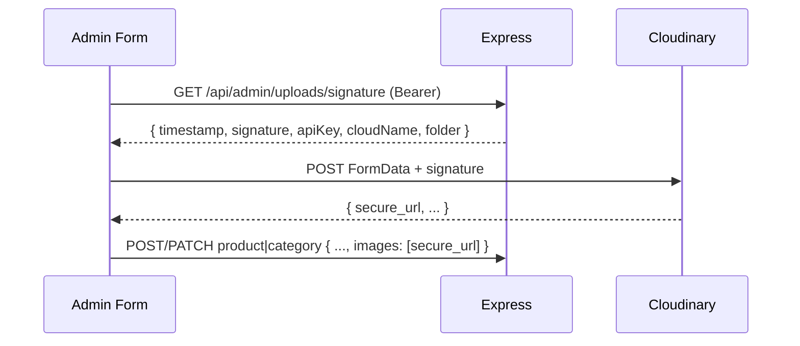

# MINAN Project Documentation

**Scope:** Marketing-focused commerce platform for lead generation and conversion.
**Market:** Bangladesh, mobile-first, 3G/4G, Facebook Ads.
**Supabase:** Not used.
**Database:** Data persistence is MongoDB Atlas through the Express API.
**Next.js Route Handlers:** Not used for app data operations. All data operations go through Express.

---

## 1. Project Meta

| Property  | Value                                       |
| --------- | ------------------------------------------- |
| Framework | Next.js 16.2.7 App Router                   |
| Phase     | MVP v1                                      |
| Market    | Bangladesh (Sylhet)                         |
| Traffic   | Facebook Ads                                |
| Payment   | Not in MVP - bKash TX ID collected manually |

---

## 2. Business Goals

- Premium brand experience
- Lead collection through checkout into first-party MongoDB data
- Meta Pixel + CAPI infrastructure with event deduplication
- Role-based admin dashboard
- Supports future e-commerce migration
- Facebook custom audience retargeting

---

## 3. Coding Principles

- Follow this documentation and the existing repo patterns before introducing new patterns.
- Follow Next.js 16 conventions: use `proxy.ts`, not `middleware.ts`.
- Production-ready code only. No placeholders or TODO stubs.
- TypeScript strict mode everywhere: no `any`, no `as unknown` casting.
- No Next.js Route Handlers under `app/api/` for data operations.
- No Next.js Server Actions: `*.actions.ts` files are plain async functions that call Express.
- GSAP only for animations. Do not use or suggest Framer Motion.
- Zustand only for global client state.
- React Hook Form + Zod for forms.
- Do not target Radix UI internal DOM nodes with GSAP.
- Tailwind v4 utility classes only. No arbitrary CSS-in-JS.
- Frontend Zod schemas live in `features/<domain>/schemas/`; backend keeps independent equivalent schemas.
- `next/image` for images. Never raw `` tags.
- `next/link` for internal routes. Never raw `<a>` tags for internal navigation.
- Cloudinary URLs are the production image-storage target. Seed data may use temporary remote placeholder URLs.
- BD phone validation regex: `/^(?:\+?88)?01[3-9]\d{8}$/`

---

## 4. Tech Stack

### Frontend

| Technology      | Version / Rule                         |
| --------------- | -------------------------------------- |
| Next.js         | 16.2.7 (App Router, `proxy.ts`)        |
| React           | 19.2.7 (Compiler enabled)              |
| TypeScript      | 6.0.3, strict                          |
| Tailwind CSS    | 4.3.0                                  |
| shadcn/ui       | via `shadcn` package                   |
| Zustand         | 5.x                                    |
| React Hook Form | 7.x                                    |
| Zod             | 4.x                                    |
| GSAP            | 3.x                                    |
| Cloudinary      | via signed uploads + `next/image`      |

### Backend

| Technology         | Version / Rule                 |
| ------------------ | ------------------------------ |
| Node.js            | 24.16.0                        |
| Express.js         | 5.2.1                          |
| MongoDB Atlas      | 8.3 managed cluster target     |
| MongoDB driver     | 7.4.0                          |
| Mongoose           | 9.7.3                          |
| jsonwebtoken       | 9.x                            |
| argon2             | 0.44.x                         |
| cookie-parser      | 1.4.x                          |
| cors               | 2.8.x                          |
| express-rate-limit | 8.x                            |
| helmet             | 8.x                            |
| Zod                | 4.x                            |

### Infrastructure

| Service           | Role                                      | Status             |
| ----------------- | ----------------------------------------- | ------------------ |
| Vercel            | Frontend                                  | Target             |
| Render            | Express API, Node 24.16.0                 | Target             |
| MongoDB Atlas     | Managed MongoDB 8.3                       | Target             |
| Cloudinary        | Image storage + CDN                       | Implemented        |
| Meta Pixel + CAPI | Client helpers + server CAPI              | Partial            |
| GA4               | Traffic + behavior                        | Planned            |
| Microsoft Clarity | Session recordings + heatmaps             | Planned            |

---

## 5. Architecture

```
Browser -> Next.js (Vercel) -> Express API (Render) -> MongoDB Atlas
```

### Auth Cookie Strategy - Cross-Domain Requirement

Both frontend and backend must run on subdomains of the same parent domain so cookies are readable by `proxy.ts`:

| Service           | Domain          |
| ----------------- | --------------- |
| Frontend (Vercel) | `app.minan.com` |
| Backend (Render)  | `api.minan.com` |

Express sets auth cookies with `Domain=.minan.com`. This lets the browser send the access token cookie on page requests to `app.minan.com`, so `proxy.ts` can verify admin auth before protected pages render.

**Production admin auth requires custom domains.** It will not work correctly across default `*.vercel.app` and `*.onrender.com` domains because they do not share a parent domain.

### Request Layers

| Layer              | Role                                                                   |
| ------------------ | ---------------------------------------------------------------------- |
| `proxy.ts`         | Reads httpOnly access token cookie, verifies JWT, redirects if invalid |
| Next.js Client     | Sends `Authorization: Bearer <token>` from Zustand on API calls        |
| Express Middleware | Verifies Bearer token independently on protected routes                |
| Express Routes     | Business logic, DB ops, CAPI, rate limiting                            |
| Mongoose           | Persistence                                                            |

### `proxy.ts`

`proxy.ts` is placed at `apps/web/src/proxy.ts` and exports the standard Next.js proxy function plus static `config.matcher`. It does not need registration in `next.config.ts`.

### Admin Boot Flow

`app/(admin)/admin/layout.tsx` wraps protected admin routes in `AdminSessionProvider`. On mount, `AdminSessionProvider` calls `POST /api/auth/refresh` to:

1. Exchange a valid refresh token cookie for new tokens
2. Repopulate `auth.store.ts` with the new access token and role

If refresh fails, the client clears Zustand and redirects to `/admin/login`.

### CORS

| Option        | Value                                            |
| ------------- | ------------------------------------------------ |
| `origin`      | `ALLOWED_ORIGIN`, production value `https://app.minan.com` |
| `credentials` | `true`                                           |

Never use `*` for CORS origin.

---

## 6. Authentication

**Scope:** Admin-only. No public user auth in MVP.
**Pattern:** Two-token JWT with server-side refresh-token hash rotation.

### Token Storage

| Token         | Storage                          | TTL    |
| ------------- | -------------------------------- | ------ |
| Access Token  | httpOnly cookie + Zustand memory | 15 min |
| Refresh Token | httpOnly cookie + hashed in DB   | 7 days |

- Cookie access token -> `proxy.ts` server-side admin guard
- Zustand access token -> `Authorization: Bearer` header for Express API calls
- Refresh token hash -> `admin_users.refresh_token_hash`
- Previous refresh token hash -> `admin_users.previous_refresh_token_hash` for concurrent refresh detection

### Cookie Config

| Flag       | Production Value                                         |
| ---------- | -------------------------------------------------------- |
| `httpOnly` | `true`                                                   |
| `secure`   | `true`                                                   |
| `sameSite` | `none` (cross-origin: `app.minan.com` <-> `api.minan.com`) |
| `domain`   | `.minan.com`                                             |
| `path`     | `/`                                                      |

Local development uses `secure: false`, `sameSite: "lax"`, and no cookie domain.

### Auth Flow

1. `POST /api/auth/login` -> argon2 verify -> issue access + refresh cookies and return access token + role in the response body
2. Express stores `argon2.hash(refreshToken)` on the admin user and clears `previous_refresh_token_hash`
3. Next.js stores access token and role in `auth.store.ts`
4. `proxy.ts` reads the access token cookie and blocks unauthenticated admin renders
5. API calls send `Authorization: Bearer <accessToken>` from Zustand
6. 401 -> `POST /api/auth/refresh` -> Express atomically rotates refresh-token hash and returns a new access token + role
7. Concurrent refresh with the immediately previous token returns `409 Concurrent token rotation`
8. `POST /api/auth/logout` clears cookies and nulls refresh-token hashes

Only the refresh token whose hash matches `refresh_token_hash` is accepted, with a narrow previous-token check for concurrent rotation. Replay of older refresh JWTs fails after rotation. Deactivated admins fail login and refresh.

### CSRF Mitigation

- `X-Requested-With: XMLHttpRequest` is required on all state-changing requests
- Browser form posts from third-party sites cannot set this custom header
- Refresh-token rotation limits replay after a successful refresh

---

## 7. Admin Roles

| Role      | Access                                          |
| --------- | ----------------------------------------------- |
| `general` | Dashboard read-only                             |
| `premium` | Full CRUD - products, categories, leads, admins |

### Permission Matrix

| Feature                     | general | premium |
| --------------------------- | ------- | ------- |
| View Dashboard + Traffic    | yes     | yes     |
| Product CRUD                | no      | yes     |
| Category CRUD               | no      | yes     |
| Lead Read / Create / Update | no      | yes     |
| Admin CRUD                  | no      | yes     |

### Enforcement

- Role in JWT payload: `{ id, email, role }`
- Express middleware checks role per route, never from request body
- `proxy.ts` reads role from JWT cookie only for server-side admin route gating
- Role change requires token refresh to take effect

### Self-Guard Rule

A premium admin cannot demote or deactivate their own account:

- `PATCH /api/admin/admins/:id` rejects self role changes and self `is_active: false`
- `PATCH /api/admin/admins/:id/deactivate` rejects self-deactivation
- Enforcement lives in the admins service/controller, not middleware

---

## 8. Database - MongoDB Atlas 8.3, Mongoose 9.x

### `products`

| Field                     | Type                       | Notes                         |
| ------------------------- | -------------------------- | ----------------------------- |
| `_id`                     | ObjectId                   | PK                            |
| `name`                    | String                     | required                      |
| `slug`                    | String                     | required, unique              |
| `description`             | String                     | required                      |
| `price`                   | Number                     | required, min: 0              |
| `category_id`             | ObjectId (ref: `Category`) | required                      |
| `sizes`                   | [String]                   | default `[]`                  |
| `colors`                  | [String]                   | default `[]`                  |
| `images`                  | [String]                   | remote image URLs             |
| `is_active`               | Boolean                    | default `true`                |
| `createdAt` / `updatedAt` | Date                       | timestamps                    |

### `categories`

| Field                     | Type     | Notes              |
| ------------------------- | -------- | ------------------ |
| `_id`                     | ObjectId | PK                 |
| `name`                    | String   | required           |
| `slug`                    | String   | required, unique   |
| `image_url`               | String   | remote image URL   |
| `is_active`               | Boolean  | default `true`     |
| `createdAt` / `updatedAt` | Date     | timestamps         |

### `leads`

| Field                     | Type     | Notes |
| ------------------------- | -------- | ----- |
| `_id`                     | ObjectId | PK |
| `name`                    | String   | required |
| `phone_number`            | String   | required, BD format |
| `email`                   | String   | required |
| `address`                 | String   | required |
| `notes`                   | String   | optional |
| `bkash_txn_id`            | String   | optional |
| `cart_snapshot`           | Object   | `{ items: Array<{ product_id, name, price, size, color, quantity }>, total }` |
| `status`                  | String   | `pending | confirmed | cancelled`, default `pending` |
| `createdAt` / `updatedAt` | Date     | timestamps |

### `analytics_events`

| Field          | Type                       | Notes |
| -------------- | -------------------------- | ----- |
| `_id`          | ObjectId                   | PK |
| `event_type`   | String                     | `page_view | product_view | add_to_cart | checkout_start | lead_submit | whatsapp_click` |
| `event_id`     | String                     | UUID, unique, CAPI dedup key |
| `product_id`   | ObjectId (ref: `Product`)  | optional |
| `category_id`  | ObjectId (ref: `Category`) | optional |
| `session_id`   | String                     | required |
| `utm_source`   | String                     | optional |
| `utm_medium`   | String                     | optional |
| `utm_campaign` | String                     | optional |
| `createdAt`    | Date                       | timestamp only |

`analytics_events` uses `{ timestamps: { createdAt: true, updatedAt: false } }`.

### `admin_users`

| Field                         | Type        | Notes |
| ----------------------------- | ----------- | ----- |
| `_id`                         | ObjectId    | PK |
| `email`                       | String      | required, unique, lowercase |
| `password`                    | String      | argon2 hashed, never in API response |
| `role`                        | String      | `general | premium` |
| `is_active`                   | Boolean     | default `true` |
| `refresh_token_hash`          | String/null | selected only when needed |
| `previous_refresh_token_hash` | String/null | selected only when needed, concurrent rotation guard |
| `createdAt` / `updatedAt`     | Date        | timestamps |

### Mongoose Patterns

- `timestamps: true` on all schemas except `analytics_events`
- Soft deletes through `is_active`; no hard deletes for products, categories, or admins
- `populate("category_id")` on product queries when category data is needed
- Indexes: product/category `slug`, admin `email`, analytics `{ event_type, createdAt }`, analytics `event_id`
- `pre("save")` on admin users hashes passwords
- `toJSON` transform on admin users strips password and refresh-token hashes

---

## 9. API Routes (Express)

### Public

| Method | Route                 | Description |
| ------ | --------------------- | ----------- |
| GET    | `/api/products`       | List active products. Query params: `category`, `search`, `page`, `limit`, `exclude` |
| GET    | `/api/products/:slug` | Single active product by slug |
| POST   | `/api/leads`          | Submit checkout lead, rate-limited 5 req/15 min/IP |
| POST   | `/api/analytics`      | Log analytics event and forward mapped events to Meta CAPI |
| POST   | `/api/whatsapp-click` | Log WhatsApp click and forward to Meta CAPI |
| POST   | `/api/auth/login`     | Admin login, rate-limited 10 req/15 min/IP |
| POST   | `/api/auth/refresh`   | Rotate tokens |
| POST   | `/api/auth/logout`    | Clear auth cookies and refresh-token hashes |

There is no public `GET /api/categories` route. Public category navigation currently comes from frontend constants and seed data.

### Protected Admin

| Method | Route                                  | Role              | Description |
| ------ | -------------------------------------- | ----------------- | ----------- |
| GET    | `/api/admin/dashboard`                 | general + premium | Placeholder metrics response |
| GET    | `/api/admin/leads`                     | premium           | List leads |
| GET    | `/api/admin/leads/:id`                 | premium           | Get single lead |
| PATCH  | `/api/admin/leads/:id`                 | premium           | Update lead status + notes |
| GET    | `/api/admin/products`                  | premium           | List all products, including inactive |
| POST   | `/api/admin/products`                  | premium           | Create product |
| PATCH  | `/api/admin/products/:id`              | premium           | Update product, including `is_active: true` reactivation |
| PATCH  | `/api/admin/products/:id/deactivate`   | premium           | Soft delete |
| GET    | `/api/admin/categories`                | premium           | List all categories |
| POST   | `/api/admin/categories`                | premium           | Create category |
| PATCH  | `/api/admin/categories/:id`            | premium           | Update category, including `is_active: true` reactivation |
| PATCH  | `/api/admin/categories/:id/deactivate` | premium           | Soft delete, blocked when active products reference the category |
| GET    | `/api/admin/admins`                    | premium           | List admins |
| POST   | `/api/admin/admins`                    | premium           | Create admin |
| PATCH  | `/api/admin/admins/:id`                | premium           | Update admin, including `is_active: true` reactivation |
| PATCH  | `/api/admin/admins/:id/deactivate`     | premium           | Soft disable |
| GET    | `/api/admin/uploads/signature`         | premium           | Get Cloudinary signed upload params |

Admin write routes require `requireAuth`, `requireRole(["premium"])`, and `requireCsrfHeader`.

---

## 10. Pages / Routes

| Route               | Page                | Access            |
| ------------------- | ------------------- | ----------------- |
| `/`                 | Home                | Public            |
| `/products`         | Product Listing     | Public            |
| `/products/[slug]`  | Product Detail      | Public            |
| `/cart`             | Cart                | Public            |
| `/checkout`         | Checkout            | Public            |
| `/admin/login`      | Admin Login         | Public            |
| `/admin`            | Dashboard           | General + Premium |
| `/admin/products`   | Product Management  | Premium           |
| `/admin/categories` | Category Management | Premium           |
| `/admin/leads`      | Lead Management     | Premium           |
| `/admin/admins`     | Admin Management    | Premium           |

`/admin/login` lives under the public route group at `app/(public)/admin/login/page.tsx`. Protected admin routes live under `app/(admin)/admin/`.

---

## 11. Frontend Structure Rules

- `app/(public)/` contains storefront routes.
- `app/(admin)/admin/` contains protected admin routes and the admin shell layout.
- `app/(public)/admin/login/page.tsx` is public so unauthenticated admins can reach it.
- Public layout chrome is `components/layouts/PublicChrome.tsx`.
- Admin layout chrome is `components/layouts/AdminShell.tsx`.
- `features/<domain>/` colocates domain components, hooks, actions, services, schemas, and types.
- `features/<domain>/actions/*.actions.ts` are plain async functions calling Express. No `"use server"`.
- `components/ui/` is shadcn/ui output.
- `lib/api/client.ts` is the fetch wrapper. Do not use axios.
- `lib/analytics/pixel.ts` contains client-side Meta Pixel helpers only. CAPI is Express-only.
- `store/auth.store.ts` keeps access token and role in memory only.
- `store/cart.store.ts` keeps cart items in memory only.

---

## 12. Checkout / Lead Form

| Field          | Type     | Required | Notes |
| -------------- | -------- | -------- | ----- |
| `name`         | text     | yes      | min 2, max 80 |
| `phone_number` | text     | yes      | BD regex `/^(?:\+?88)?01[3-9]\d{8}$/` |
| `email`        | email    | yes      | valid email |
| `address`      | textarea | yes      | min 8, max 400 |
| `notes`        | textarea | no       | max 500 |
| `bkash_txn_id` | text     | no       | manual admin verification, max 80 |

`POST /api/leads` is rate-limited to 5 req / 15 min / IP.

---

## 13. MVP Features

- Animated UI with GSAP, responsive, mobile-first
- Product categories: T-Shirts, Shirts, Pants, Footwear, Accessories, Women, Kids
- WhatsApp ordering from PDP with pre-filled message and `/api/whatsapp-click`
- Cart stored in Zustand memory only
- Checkout lead form writes to MongoDB `leads`
- Role-gated admin CRUD for products, categories, leads, and admins
- Dashboard screen exists; real metric aggregation is planned

---

## 14. Analytics & Tracking

Analytics is partially implemented. Keep current/live behavior separate from planned wiring.

### Tool Matrix

| Tool               | Fires From     | Role                                      | Status |
| ------------------ | -------------- | ----------------------------------------- | ------ |
| Meta Pixel helpers | Next.js client | `fbq("track")` helpers                    | Partial - helpers exist, no global bootstrap script |
| Meta CAPI          | Express        | Server-side mapped events                 | Implemented for events posted to analytics endpoints |
| GA4                | Next.js client | Traffic and conversion analytics          | Planned |
| Microsoft Clarity  | Next.js client | Session recordings and heatmaps           | Planned |
| `analytics_events` | Express        | First-party MongoDB analytics log         | Implemented |

### Current Event Status

| Event            | Client Pixel | Express CAPI | Status |
| ---------------- | ------------ | ------------ | ------ |
| `page_view`      | planned      | no           | Planned |
| `product_view`   | helper-ready | endpoint-ready | Planned wiring |
| `add_to_cart`    | helper-ready | endpoint-ready | Planned wiring |
| `checkout_start` | helper-ready | endpoint-ready | Planned wiring |
| `lead_submit`    | no           | backend-ready | Not fired by `POST /api/leads` yet |
| `whatsapp_click` | yes          | yes          | Live |

### Deduplication Pattern

For deduped events:

1. Client generates `event_id` with `crypto.randomUUID()`
2. Client fires Meta Pixel with `event_id`
3. Client POSTs to Express with the same `event_id`
4. Express writes `analytics_events` and forwards to Meta CAPI
5. Meta deduplicates on matching `event_id`

Current end-to-end live path: `whatsapp_click`.

---

## 15. Performance

- Mobile-first, optimized for Bangladesh 3G/4G users
- Public catalog/product pages currently use `export const dynamic = "force-dynamic"` for fresh Express-backed data
- Do not document `use cache` / `dynamicIO` as current behavior until the app explicitly adopts that caching model
- Turbopack in development
- MongoDB indexes: product/category `slug`, admin `email`, analytics `{ event_type, createdAt }`, analytics `event_id`
- GSAP animation should stay on `transform` and `opacity`
- Render cold start mitigation can use a keep-alive ping if on free-tier instances

---

## 16. Security

| Concern          | Mitigation |
| ---------------- | ---------- |
| XSS token theft  | httpOnly cookies for browser-stored tokens |
| CSRF             | `X-Requested-With: XMLHttpRequest` on state-changing requests |
| Password storage | argon2 |
| Refresh replay   | server-side refresh-token hash rotation |
| Token expiry     | Access: 15 min; Refresh: 7 days |
| Brute force      | rate-limit `/api/auth/login` |
| Checkout spam    | rate-limit `/api/leads` |
| HTTP headers     | `helmet` |
| CORS             | specific `ALLOWED_ORIGIN`, credentials enabled, never `*` |
| Password leak    | Mongoose `toJSON` strips `password` |
| Role escalation  | Role from JWT only, never request body |

---

## 17. Deployment & Env Vars

| Service  | Platform              | Domain          |
| -------- | --------------------- | --------------- |
| Frontend | Vercel                | `app.minan.com` |
| Backend  | Render, Node 24.16.0  | `api.minan.com` |
| Database | MongoDB Atlas 8.3     | -               |
| Images   | Cloudinary            | -               |

Custom domains are required for production admin cookie auth.

### Frontend `.env.local`

```env
NEXT_PUBLIC_API_URL=https://api.minan.com
API_PROXY_TARGET=https://api.minan.com
JWT_ACCESS_SECRET=<same value as API>
NEXT_PUBLIC_META_PIXEL_ID=
NEXT_PUBLIC_GA4_ID=
NEXT_PUBLIC_CLOUDINARY_CLOUD_NAME=
NEXT_PUBLIC_WHATSAPP_NUMBER=01XXXXXXXXX
```

- `NEXT_PUBLIC_API_URL` is used by `lib/api/client.ts`.
- `API_PROXY_TARGET` is used by `next.config.ts` rewrites for `/api/:path*`.
- `JWT_ACCESS_SECRET` is required by `proxy.ts` to verify access-token cookies.

### Backend `.env`

```env
MONGODB_URI=
JWT_ACCESS_SECRET=
JWT_REFRESH_SECRET=
ALLOWED_ORIGIN=https://app.minan.com
META_CAPI_TOKEN=
META_PIXEL_ID=
CLOUDINARY_URL=
CLOUDINARY_UPLOAD_FOLDER=
ADMIN_EMAIL=
ADMIN_PASSWORD=
ADMIN_ROLE=
NODE_ENV=
```

`seed:admin` upserts by `ADMIN_EMAIL`. Rerunning it updates that admin's password, role, and `is_active: true`.

---

## 18. Planned Admin Dashboard Metrics

`GET /api/admin/dashboard` currently returns placeholder zeros/nulls. The intended future metrics are:

| Metric              | Intended Query |
| ------------------- | -------------- |
| Today's Leads       | `leads` count by current day |
| This Month's Leads  | `leads` count by current month |
| Most Viewed Product | `analytics_events` product_view aggregation by `product_id` |
| Top Category        | `analytics_events` product_view aggregation by `category_id` |
| Traffic Source      | `analytics_events` aggregation by `utm_source` |

Do not treat these aggregations as implemented until `dashboard.controller.ts` is updated.

---

## 19. Future Roadmap

- Payment Gateway (bKash API, SSLCommerz)
- Order Management
- Customer Accounts
- Inventory per SKU
- Coupons, Reviews, Recommendations
- Marketing Automation (email/SMS)
- Advanced Analytics, Order Tracking

---

## 20. Backend Structure Rules

- `apps/api/src/models/` contains Mongoose models: products, categories, leads, analytics events, admins.
- `apps/api/src/schemas/` contains backend Zod schemas. Backend schemas are independent from frontend schemas.
- `apps/api/src/services/` owns business logic and DB access.
- `apps/api/src/controllers/` owns Express request/response handling.
- `apps/api/src/routes/` declares route wiring and middleware order.
- `apps/api/src/middleware/` owns auth, role, CSRF, and error middleware.
- `apps/api/src/lib/` owns shared backend helpers such as tokens, Cloudinary, Meta CAPI, slugify, pagination, and Mongo error handling.
- `apps/api/src/utils/` owns response serializers.
- Public routers: products, leads, analytics, whatsapp-click, auth.
- Admin router is mounted at `/api/admin`.
- Dashboard stays accessible to `general` and `premium`.
- All admin writes require auth, premium role, and CSRF header.
- Slugs are generated through `lib/slugify.ts`; duplicate slugs resolve with suffixes in current admin services.
- Admin serializers and model transforms must never expose password or refresh-token hashes.

---

## 21. Cloudinary Image Upload Flow

Admin image uploads use a signed upload pattern: Express generates the signature, the browser posts the file directly to Cloudinary, and only the resulting `secure_url` is stored in MongoDB.



**Frontend:** `lib/cloudinary/upload.ts` orchestrates the flow using `NEXT_PUBLIC_CLOUDINARY_CLOUD_NAME`.
**Backend:** `lib/cloudinary.ts` signs the upload using `CLOUDINARY_URL`; optional folder via `CLOUDINARY_UPLOAD_FOLDER`.
**Storage:** Only remote URL strings are persisted in MongoDB. Never store local paths or base64.
